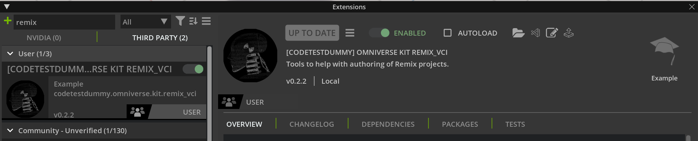
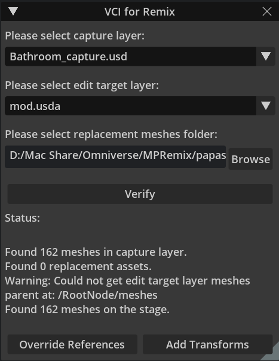

# VCI for Remix

This extension for NVIDIA Omniverse is intended to assis with Remix projects in the following ways:

- Batch-process the change of reference for updated asset meshes
- Help to re-apply the "Visual Correction" to updated asses to approximate the correct position
  - **Note:** Depending on the game, this might or might not work. This is a known issue with the Remix capture for certain games.

## Instructions

1) Download and install the extension from the "releases" setion of this repository.
2) Enable the extension in you app of choice (e.g. Composer)
   
3) Add as layers the captures from Remix which you want to use
4) Configure the extension
   - Specify the capture layer you want to use in your mod.usd file
   - Specify the authoring layer you want to use (e.g. mod.usd)
   - Specify the folder which has you update mesh_HASH.usd assets
   - Click "Verify" and handle any reported errors
   
4) If there are no errors, first click "Override References"
   - This will only update references for which there is a mesh_HASH Primspec in the capture layer and also a matching mesh_HASH.usd file in the replacements folder.
5) Click "Add Transforms"
   - This will apply the "visual correction" transform for any overrides in the authoring layer for which a matching Xform is in the capture layer.
6) Repeat steps 4-5 for all the capture layers you have added.

## Known issues
Currently, if you add a capture layer, or other wise change the layers you want to make use of, *after* enabling the extension, you need to disable and re-enable the extension. This inconvenience will be fixed in the next version. 